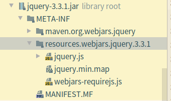
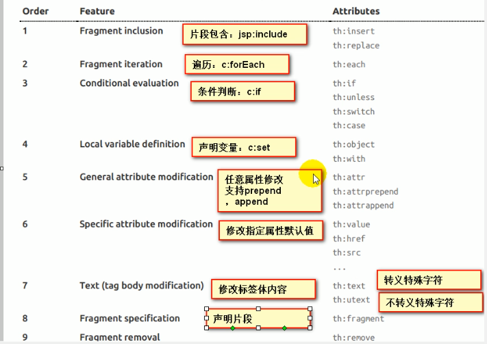

#### Web开发
1. 创建应用的时候,可以直接选择相应的模块
2. 在配置文件中编写少量的配置
3. 编写业务代码

### SpringBoot对静态资源的映射规则

```java
public void addResourceHandlers(ResourceHandlerRegistry registry) {
            if (!this.resourceProperties.isAddMappings()) {
                logger.debug("Default resource handling disabled");
            } else {
                Duration cachePeriod = this.resourceProperties.getCache().getPeriod();
                CacheControl cacheControl = this.resourceProperties.getCache().getCachecontrol().toHttpCacheControl();
                if (!registry.hasMappingForPattern("/webjars/**")) {
                    this.customizeResourceHandlerRegistration(registry.addResourceHandler(new String[]{"/webjars/**"}).addResourceLocations(new String[]{"classpath:/META-INF/resources/webjars/"}).setCachePeriod(this.getSeconds(cachePeriod)).setCacheControl(cacheControl));
                }

                String staticPathPattern = this.mvcProperties.getStaticPathPattern();
                if (!registry.hasMappingForPattern(staticPathPattern)) {
                    this.customizeResourceHandlerRegistration(registry.addResourceHandler(new String[]{staticPathPattern}).addResourceLocations(WebMvcAutoConfiguration.getResourceLocations(this.resourceProperties.getStaticLocations())).setCachePeriod(this.getSeconds(cachePeriod)).setCacheControl(cacheControl));
                }

            }
        }
```
- 所有/webjars/**, 都去classpath:/META-INF/resources/webjars/找资源
    - 以jar包的方式引入静态资源; [webjars](https://www.webjars.org/) 
    -  
    - 访问路径: http://127.0.0.1:8080/webjars/jquery/3.3.1/jquery.js
- "/**"访问任何当前项目的任何路径,如果找不的处理点默认到(静态资源文件夹)

```java
"classpath:/META-INF/resources/"
"classpath:/resources/"
"classpath:/static/"
"classpath:/public/"
比如:localhost:8080/hello.html ---> static/hello.html
```
- 欢迎页,默认是到所有静态资源文件夹下面找index.html(访问项目名)

### 模板引擎
SpringBoot推荐的模板引擎:Thymeleaf

1. 引入thymeleaf
     ```xml
       <dependency>
            <groupId>org.springframework.boot</groupId>
            <artifactId>spring-boot-starter-thymeleaf</artifactId>
       </dependency>
     ```
    
2. Thymeleaf使用&语法
    ```java
    @ConfigurationProperties(
    prefix = "spring.thymeleaf"
)
public class ThymeleafProperties {
    private static final Charset DEFAULT_ENCODING;
    public static final String DEFAULT_PREFIX = "classpath:/templates/";
    public static final String DEFAULT_SUFFIX = ".html";
    //把HTML页面放在templates下,就可以自动渲染
    ```
    - 导入thymeleaf的名称空间
    ```xml
    <html xmlns:th="http://www.thymeleaf.org">
    ```
    - 使用thymeleaf语法
    ```xml
    <!DOCTYPE html>
    <html lang="en"
          xmlns:th="http://www.thymeleaf.org">
    
    <head>
        <meta charset="UTF-8">
        <title>Title</title>
    </head>
    <body>
        <h1>SUCCESS!!</h1>
    <!--th:text 将div里面的文本内容设置为-->
        <div th:text="${hello}"></div>
    </body>
    </html>
    ```
3. 语法规则
    - th:text: 改变当前元素里面的文本内容 
        - th:任意html属性 --> 来替换元素属性值
        -  
    - 表达式
    
```properties
Simple expressions:（表达式语法）
    Variable Expressions: ${...}：获取变量值；OGNL；
    		1）、获取对象的属性、调用方法
    		2）、使用内置的基本对象：
    			#ctx : the context object.
    			#vars: the context variables.
                #locale : the context locale.
                #request : (only in Web Contexts) the HttpServletRequest object.
                #response : (only in Web Contexts) the HttpServletResponse object.
                #session : (only in Web Contexts) the HttpSession object.
                #servletContext : (only in Web Contexts) the ServletContext object.
                
                ${session.foo}
            3）、内置的一些工具对象：
#execInfo : information about the template being processed.
#messages : methods for obtaining externalized messages inside variables expressions, in the same way as they would be obtained using #{…} syntax.
#uris : methods for escaping parts of URLs/URIs
#conversions : methods for executing the configured conversion service (if any).
#dates : methods for java.util.Date objects: formatting, component extraction, etc.
#calendars : analogous to #dates , but for java.util.Calendar objects.
#numbers : methods for formatting numeric objects.
#strings : methods for String objects: contains, startsWith, prepending/appending, etc.
#objects : methods for objects in general.
#bools : methods for boolean evaluation.
#arrays : methods for arrays.
#lists : methods for lists.
#sets : methods for sets.
#maps : methods for maps.
#aggregates : methods for creating aggregates on arrays or collections.
#ids : methods for dealing with id attributes that might be repeated (for example, as a result of an iteration).

    Selection Variable Expressions: *{...}：选择表达式：和${}在功能上是一样；
    	补充：配合 th:object="${session.user}：
   <div th:object="${session.user}">
    <p>Name: <span th:text="*{firstName}">Sebastian</span>.</p>
    <p>Surname: <span th:text="*{lastName}">Pepper</span>.</p>
    <p>Nationality: <span th:text="*{nationality}">Saturn</span>.</p>
    </div>
    
    Message Expressions: #{...}：获取国际化内容
    Link URL Expressions: @{...}：定义URL；
    		@{/order/process(execId=${execId},execType='FAST')}
    Fragment Expressions: ~{...}：片段引用表达式
    		<div th:insert="~{commons :: main}">...</div>
    		
Literals（字面量）
      Text literals: 'one text' , 'Another one!' ,…
      Number literals: 0 , 34 , 3.0 , 12.3 ,…
      Boolean literals: true , false
      Null literal: null
      Literal tokens: one , sometext , main ,…
Text operations:（文本操作）
    String concatenation: +
    Literal substitutions: |The name is ${name}|
Arithmetic operations:（数学运算）
    Binary operators: + , - , * , / , %
    Minus sign (unary operator): -
Boolean operations:（布尔运算）
    Binary operators: and , or
    Boolean negation (unary operator): ! , not
Comparisons and equality:（比较运算）
    Comparators: > , < , >= , <= ( gt , lt , ge , le )
    Equality operators: == , != ( eq , ne )
Conditional operators:条件运算（三元运算符）
    If-then: (if) ? (then)
    If-then-else: (if) ? (then) : (else)
    Default: (value) ?: (defaultvalue)
Special tokens:
    No-Operation: _ 
```
### SpringMVC自动配置
参考[官方文档](https://docs.spring.io/spring-boot/docs/2.2.6.RELEASE/reference/html/spring-boot-features.html#boot-features-developing-web-applications) 
Spring Boot 自动配置好SpringMVC
以下是SpringBoot对SpringMVC的默认配置:
- 包含ContentNegotiatingViewResolver和BeanNameViewResolver。
- 支持服务静态资源，包括对WebJars的支持（在本文档的后面部分中有介绍）。
- 自动注册Converter，GenericConverter和Formatter豆类。
- 支持HttpMessageConverters（在本文档后面介绍）。
- 自动注册MessageCodesResolver（在本文档后面介绍）。
- 静态index.html支持。
- 定制Favicon支持（在本文档后面部分中介绍）。
- 自动使用ConfigurableWebBindingInitializerbean（在本文档后面部分中介绍）。

### 修改SpringBoot的默认配置
- SpringBoot在自动配置的时候,先看容器中有没有用户自己配置的(@Bean,@Component) 如果有就用用户配置,没有才自动配置;有些组件可以有多个(ViewResolver)
- 扩展SpringMVC --> 编写一个配置类(@Configuration),是WebMVCConfigureAdapter类型,不能标注@EnableWebMVC
    ```java
//使用WebMvcConfigurerAdapter可以扩展SpringMVC功能
@Configuration
public class MyMvcConfig extends WebMvcConfigurerAdapter {

    @Override
    public void addViewControllers(ViewControllerRegistry registry) {
//        super.addViewControllers(registry);
//        浏览器发送 /yang 请求来到 success
        registry.addViewController("/yang").setViewName("success");
    }
}

    ```
    - 既保留了所有的自动配置,也能用扩展配置
    - 原理：

    - WebMvcAutoConfiguration是SpringMVC的自动配置类

    - 在做其他自动配置时会导入；@Import(**EnableWebMvcConfiguration**.class)

    ```java
        @Configuration
    	public static class EnableWebMvcConfiguration extends DelegatingWebMvcConfiguration {
          private final WebMvcConfigurerComposite configurers = new WebMvcConfigurerComposite();
    
    	 //从容器中获取所有的WebMvcConfigurer
          @Autowired(required = false)
          public void setConfigurers(List<WebMvcConfigurer> configurers) {
              if (!CollectionUtils.isEmpty(configurers)) {
                  this.configurers.addWebMvcConfigurers(configurers);
                	//一个参考实现；将所有的WebMvcConfigurer相关配置都来一起调用；  
                	@Override
                 // public void addViewControllers(ViewControllerRegistry registry) {
                  //    for (WebMvcConfigurer delegate : this.delegates) {
                   //       delegate.addViewControllers(registry);
                   //   }
                  }
              }
    	}
    ```

    - 容器中所有的WebMvcConfigurer都会一起起作用；

    - 我们的配置类也会被调用；

    - 效果：SpringMVC的自动配置和我们的扩展配置都会起作用；

- 全面接管SpringMVC；

SpringBoot对SpringMVC的自动配置不需要了，所有都是我们自己配置；所有的SpringMVC的自动配置都失效了

